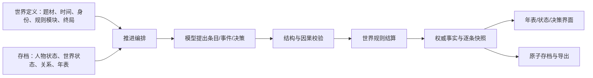

# NewLife 产品结构与规则重组方案

状态：分阶段实施中。基于 2026-09-23 的仓库源码整理；规则分流、四个内置世界的新局规则，以及工坊的两类规则模板已接入。自建开放世界新增资源逐年结算、数值目标和失败阈值；跨代接班及任意脚本规则仍需继续设计与验证。

## 1. 要解决的问题

改造前，NewLife 对外是「在不同世界经历一生」的产品，但底层默认每个世界都有一个可积累的进度、一条等级阶梯、等级决定的寿命上限，以及登顶式结局。这组规则适合《青冥仙途》，却被当成四个世界和自定义世界的共同骨架。

| 当前绑定点 | 源码位置 | 造成的产品问题 |
| --- | --- | --- |
| `WorldMechanics` 必须提供 `cultivationKey`、`realmKey`、`lifespanByRealm`、突破判定 | `src/lib/engine/types.ts`、`resolve.ts` | 题材只能替换等级和修为的名称，无法真正改变人生规则 |
| 《浮生记》把事业进度映射为修为、社会阶层映射为境界，寿命上限按阶层取值 | `src/lib/worlds/fusheng-ji.ts` | 职业与阶层的变化会直接改写个人的死亡时点；与其“没有超凡力量”的世界设定不协调 |
| 《星海孤舟》把殖民地发展阶段放进角色属性，又用该阶段查角色寿命 | `src/lib/worlds/star-ark.ts` | 殖民地状态和个人生命状态混在一起，难以表达跨代建设 |
| 决策节奏与段落跨度读取等级、寿命；重要决策由突破和寿元将尽触发 | `src/lib/engine/decision.ts`、`pacing.ts` | 非等级世界也只能借用修仙式转折点 |
| 自定义世界生成和数值校准要求等级表、寿命阶梯、登顶率 | `src/lib/worlds/forge.ts`、`src/lib/engine/simulate.ts` | “自定义世界”实际上只能生成同一玩法的题材变体 |
| 通用页面固定展示寿元、阶位、修行、资质与寿元天花板 | `src/components/game/StatusPanel.tsx`、`Timeline.tsx`、`src/app/new/page.tsx` | 非修仙世界仍向玩家传达修仙目标 |

因此，重组不能只改文字。需要把**人生推进的共同流程**和**世界专有的结算规则**拆开。

## 2. 产品定位与设计边界

建议定位：**多题材互动人生模拟器**。玩家选择一个世界和身份，世界按自身时间尺度推进；玩家在会改变人物、关系或世界走向的节点行动；结局由这个世界声明的条件和已经发生的事实产生。

这里的「人生」指从开局状态到一个可回顾的终局，不要求每个世界都以死亡结束，也不要求每个世界都能登顶。《青冥仙途》仍保留修炼、突破和寿元压力；其他世界可以有完全不同的成长与终局。

用户已要求按此方案开始实施。若后续决定所有世界共享一套数值规则，应明确标注“同一套人生玩法的不同题材”，不要继续声称每个世界都有自己的独立法则。

### 所有世界共用的承诺

1. **时间会前进**：以条目构成年表，按世界配置的时间单位推进；点击「继续」时，条目逐条出现，状态与已结算的条目同步。
2. **因果可追溯**：行动、事件、资源变化和结局能在记录中找到依据；模型提出内容，程序验证并结算。
3. **玩家有介入机会**：关键抉择来自真实的利益冲突、风险、关系或目标变化，并有最长等待间隔作为兜底。
4. **世界规则可信**：界面、模型提示词、校验和结算使用同一份规则；角色没有发生的晋升、死亡或成功不能先写进剧情。
5. **人生可保存和回看**：存档、导出、旧档继续游玩、结局回顾都属于核心体验。

### 不强制所有世界拥有的规则

等级、经验/修为条、突破、寿元随等级增长、天赋掷点、死亡、登顶与跨代接班均为可选规则。存在这些规则的世界要明确它们属于**角色**还是**世界**。

## 3. 玩家看见的产品结构

| 页面/环节 | 用户要解决的问题 | 建议呈现 |
| --- | --- | --- |
| 世界库 | 我想经历什么样的人生？ | 先说明题材、玩家身份、核心压力、可做的决定、可能的终局；不要统一用“最高阶位”介绍世界 |
| 开局 | 我是谁，从哪里开始？ | 世界定义开局字段；修仙可选资质和天赋，现代可选出身、职业/生活处境，殖民地可选职责与初始任务 |
| 人生年表 | 这一段时间发生了什么？ | 保留逐条呈现；每条仅展示已结算事实，允许展开关键细节，当前状态随条目推进 |
| 决策 | 现在需要我决定什么？ | 明确选项会影响的对象与已知代价；重大后果由程序规则裁定，不以模型措辞代替结算 |
| 状态 | 现在有哪些值得我关注的事？ | 分为“人物”“关系/阵营”“世界/事业”“当前目标”，由世界决定可见项与顺序；只有有寿命压力的世界显示对应信息 |
| 结局与回顾 | 我的一生留下了什么？ | 显示结局原因、关键选择及其可核对的影响；允许死亡、完成目标、交棒或开放式收束等不同类型 |
| 世界工坊 | 我想创建怎样的世界？ | 先选故事目标与规则模板，再让模型补全设定；预览并校验所选规则，不强制生成阶位和寿命表 |

Jev 选项分数继续作为辅助判断信息，不进入世界状态或规则结算；低置信度时保持建议性质。

## 4. 引擎结构：共同流程与世界规则分离



### 4.1 通用引擎只负责什么

- **推进编排**：请求幂等、并发版本、生成中恢复、时间推进和“下一条”的呈现顺序。
- **提议校验**：合法结构、时间顺序、字段白名单、变化幅度、前后事实一致性。
- **状态提交**：写入本段提议、程序结算结果、逐条快照、审计警告；沿用现有 IndexedDB 原子提交能力。
- **决策节奏**：控制密度并在长时间无介入时兜底；接受世界规则产生的重大事件信号。
- **叙事一致性**：模型不能宣告程序尚未结算的等级提升、任务完成或死亡。先得到权威结果，再把结果呈现为剧情。

### 4.2 世界规则负责什么

每个世界声明自己的状态、推进方式、可发生的规则事件、决策信号和终局条件。初期不需要任意插件系统，先以**带类型的规则配置 + 少量明确的规则执行器**实现两类差异最大的世界：

1. `ranked_lifespan`：等级进度、突破、等级寿命表；服务《青冥仙途》，也承接所有旧存档。
2. `open_life`：人物健康/处境、事业和关系分别变化；没有强制等级突破，终局由人物生存和世界目标判断；先服务《浮生记》。

《灰烬王座》的公会评级和《星海孤舟》的殖民地阶段在验证上述拆分之后接入。它们可以使用“有阶段的事业/世界目标”，但阶段不自动成为角色寿命等级。不要因为名称相似就复用修仙突破公式。

### 4.3 建议的数据边界

以下是**概念结构**，不是要立刻替换现有 TypeScript 接口：

```ts
type LifeState = {
  clock: { value: number; unit: 'day' | 'month' | 'year' };
  actor: { attributes: Record<string, number>; status: string };
  world: { attributes: Record<string, number>; status: string };
  relationships: Record<string, RelationshipState>;
  objectives: ObjectiveState[];
};

type WorldRules =
  | { kind: 'ranked_lifespan'; progression: RankedProgression; mortality: RankedLifespan }
  | { kind: 'open_life'; aging: AgingRule; objectives: ObjectiveRule[] };
```

`clock` 是世界推进的时间，人物年龄只是人物状态的一部分。这样殖民地发展可以跨越某个人的一生，个人死亡也不必强制宣告殖民地失败。若第一版不做跨代玩法，仍应把这两个状态分开，并将“角色死亡时本局结束”写成《星海孤舟》的明示规则。

### 4.4 决策与结局的通用语义

“该不该停下来”不再只问是否突破或是否接近寿元上限，而问：是否出现未解决的重大风险、关系/阵营变化、资源不可逆投入、世界目标转折，或当前人物即将失去行动机会。世界规则可增加自己的信号，例如修仙突破、破产、战役、生态穹顶危机。

结局由程序给出结构化原因，再由题材提供表达；至少区分：人物死亡、目标完成、世界失败、主动退出/交棒、时间上限收束。具体世界只启用适用的类型。“达到最高等级”不再是通用成功条件。

## 5. 四个内置世界应如何落位

| 世界 | 玩家所扮演的对象 | 主要压力与成长 | 终局判定原则 |
| --- | --- | --- | --- |
| 青冥仙途 | 修行者个人 | 修为、突破、境界、寿元 | 保留当前突破和寿元玩法；程序结算飞升/死亡 |
| 浮生记 | 现代社会中的个人 | 工作、财务、健康、关系和个人目标 | 阶层可描述处境，但不直接提供“下一阶续命”；病老、选择和人生目标分别结算 |
| 灰烬王座 | 冒险者个人 | 委托、同伴、伤病、装备、声望 | 公会评级可以存在，但晋级应来自功绩/机构评定；伤病和风险决定生存，不由评级给定寿命表 |
| 星海孤舟 | 殖民地中的人物，参与集体建设 | 资源、生态、科技、殖民地阶段；个人健康独立 | 殖民地目标与人物命运分别判定；是否允许跨代接班仍需产品决定 |

这张表是**目标设计**，不是现有代码已经支持的行为。特别是现代世界的健康规则和星际世界的跨代选项，需要设计及平衡后才能落地。

## 6. 改造顺序与兼容要求

当前进度：阶段 0、1 已建立兼容路径；阶段 2 的开放人生首版已实现；阶段 3 的《星海孤舟》人物与世界数值拆分、《灰烬王座》事件驱动的公会评级已接入；阶段 4 的两类工坊模板和规则专属预览已接入。自建开放世界新增有限的结构化目标与失败条件，世界资源可逐年变化，并在阈值处由程序收束。跨代接班、多个并行目标、任意脚本规则及开放人生的剧情分布校准仍未实现。过渡期间，`WorldSetting.mechanics` 仍保留供旧规则和阶位工坊使用，开放人生结算不读取其阶位、突破与寿元表。

| 阶段 | 交付内容 | 完成判据 |
| --- | --- | --- |
| 0. 冻结旧规则边界 | 明确旧存档和旧自定义世界统一走 `ranked_lifespan`，记录现有四世界的可重复模拟结果 | 现有测试、导入导出与游戏流程仍可运行 |
| 1. 抽出规则入口 | 引入 `rulesetVersion`/规则类型，结算、提示词、节奏、状态面板从同一规则入口读取；先把青冥接到新入口 | 青冥新档与旧档的规则结果一致；不发生存档重算 |
| 2. 做出真正不同的现代世界 | 为《浮生记》实现无突破等级的 `open_life`，重写开局字段、状态、决策信号与终局 | 完整一局没有自动“晋阶续命”；剧情和状态栏同口径 |
| 3. 拆开个人与世界 | 为《星海孤舟》分离殖民地与人物状态；给《灰烬王座》按实际玩法选择规则 | 殖民地阶段变化不直接改写人物寿命；公会评级符合委托事实 |
| 4. 更新世界工坊和界面 | 工坊先选规则模板；页面按规则显示属性、提示和回顾；规则专属模拟器分别验收 | 可生成至少一种无需等级/寿命阶梯的世界；非修仙界面无固定修仙措辞 |

### 旧存档策略

- 现有 `schemaVersion = 2` 的存档和已保存的自定义世界保留原始世界快照与数值结算方式，迁移时标记为旧规则集；**不重算历史、不改写已经发生的突破或结局**。
- 新规则集只用于新开的局。旧局的“继续”仍走其创建时的规则；如需在新规则下体验同一题材，明确提示玩家新建人生。
- `schemaVersion` 表示存档对象形状；`rulesetVersion` 表示规则语义。两者分开，避免一次字段迁移静默改变玩法。
- 同时覆盖旧版导出导入、自定义世界导入、浏览器内存档读取、生成中断后的恢复和多标签页并发提交。

### 验收重点

1. 同一段条目逐条出现时，状态栏只能显示对应条目已结算的状态，不能提前显示段尾等级或结局。
2. 剧情中的等级/阶段变化必须来自程序结算；人物状态与世界状态不能互相冒充。
3. 《青冥仙途》旧档继续游玩，规则和历史保持原样。
4. 《浮生记》可以从开局到结局不经历等级突破；职业、财务、健康和关系各自按规则变化，结局有可核对的原因。
5. 《星海孤舟》的殖民地升级不会仅凭阶段变化就让角色年龄上限改变；若选择做跨代接班，接班后年表与存档必须能区分前后人物。
6. 工坊只校验当前规则模板需要的字段；模拟指标按玩法分别定义，不再对所有世界统一要求登顶率。

## 7. 需要先确定的一个产品取向

已按“**各题材可以有不同成长规则**”实施第一版：青冥保留阶位规则，其余三个内置世界使用开放人生规则；星海的殖民地状态独立保存，灰烬的公会评级由事件驱动；工坊已有开放人生与阶位成长两个模板。星海当前采取“人物死亡时本局结束”的规则，存档保留殖民地状态。下一轮重点是结构化目标、人物与世界分别判定的更多终局，以及开放人生剧情分布的校准。
